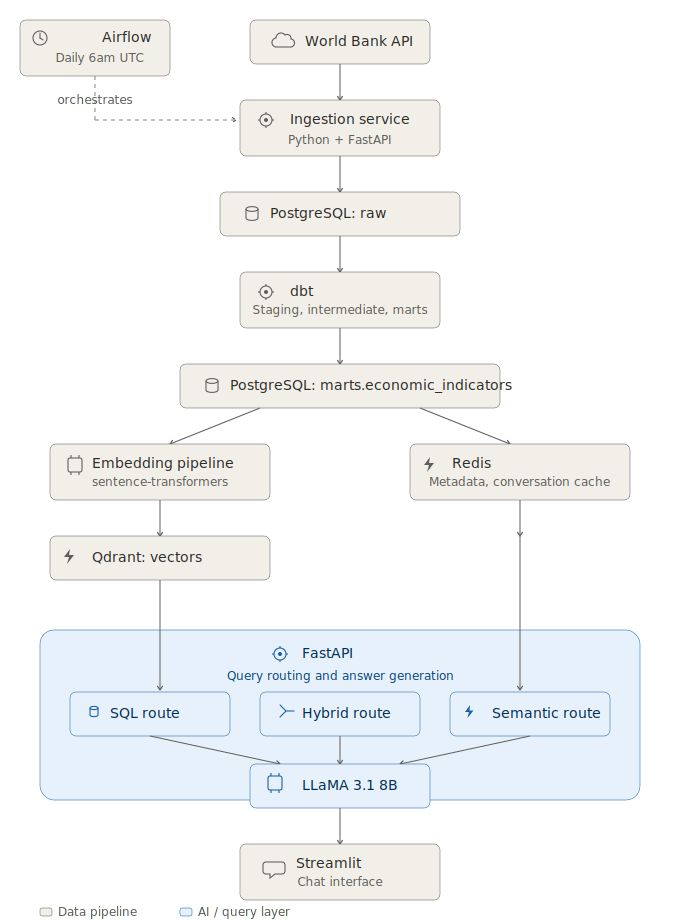
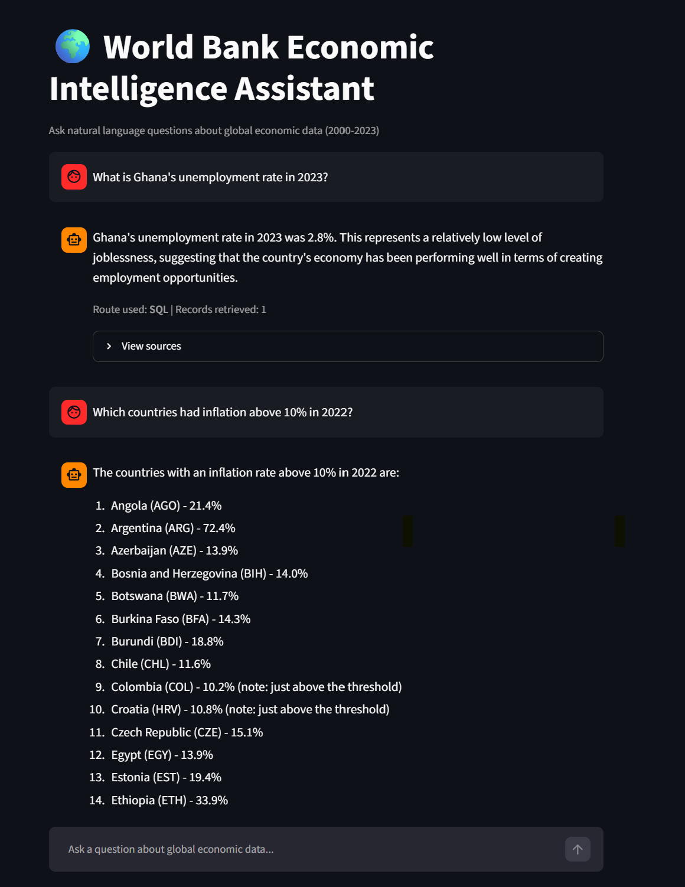

# World Bank Economic Intelligence Platform

An open-source data engineering and AI platform built on World Bank economic
indicators — GDP, inflation, unemployment, trade, and population — for 148
countries across 2000–2023.

Raw data is ingested via a Python/FastAPI service, transformed through a dbt
medallion architecture (bronze → silver → gold) with 36 automated data quality
tests, and orchestrated end to end with Apache Airflow. On top of that sits a
hybrid RAG system that answers natural language questions by intelligently
routing between SQL (for precise, filtered questions), semantic search via
Qdrant (for open-ended, conceptual questions), or both — with multi-turn
conversation memory, served through a Streamlit chat interface and powered by
LLaMA 3.1 8B running locally on GPU.

Every component is a deliberate open-source substitute for an AWS managed
service — see [Architecture](docs/architecture.md) for the full mapping and
design reasoning.

## Architecture



## See it in action



```
You: What is Ghana's unemployment rate in 2023?

Assistant: Ghana's unemployment rate in 2023 was 2.8%. This represents a
relatively low level of joblessness, suggesting the country's economy has
been performing well in terms of creating employment opportunities.

Route used: SQL | Records retrieved: 1
```

```
You: Which countries had inflation above 10% in 2022?

Assistant:
1. Angola (AGO) - 21.4%
2. Argentina (ARG) - 72.4%
3. Azerbaijan (AZE) - 13.9%
4. Bosnia and Herzegovina (BIH) - 14.0%
5. Botswana (BWA) - 11.7%
...

Route used: SQL | Records retrieved: 20
```

The system also handles natural-language follow-ups within a conversation —
asking "what about in 2006 specifically?" after a question about Ghana
correctly resolves to "What was Ghana's economic situation in 2006?" before
running the same retrieval pipeline, using conversation history stored in
Redis with a 30-minute inactivity TTL.

## Tech stack

| Layer | Tool | AWS equivalent |
|---|---|---|
| Ingestion | Python + FastAPI | Lambda |
| Storage | PostgreSQL | RDS / Aurora |
| Cache | Redis | ElastiCache |
| Transformation | dbt | Glue Studio |
| Orchestration | Apache Airflow | MWAA |
| Vector search | Qdrant | OpenSearch (vector engine) |
| LLM | LLaMA 3.1 8B (Ollama, local GPU) | Bedrock |
| Chat interface | Streamlit | — |
| Experiment tracking | MLflow | SageMaker Experiments |


Full open-source-to-AWS mapping with reasoning: [docs/architecture.md](docs/architecture.md)

## Quick start

Requires Docker and Docker Compose. No cloud account or API keys needed —
everything runs locally, including the LLM.

```bash
git clone https://github.com/abaqasif-aa/worldbank-platform
cd worldbank-platform
./setup.sh
```

`setup.sh` handles everything automatically:
- Detects Windows (WSL2) vs Linux/Mac and configures accordingly
- Copies `.env.example` to `.env` with sensible defaults
- Builds all Docker images
- Loads World Bank data into PostgreSQL
- Runs dbt transformations (36 data quality tests)
- Starts all services
- Seeds Redis cache and generates Qdrant embeddings

**One manual step — local LLM (required for RAG):**

Install [Ollama](https://ollama.com) on your host machine, then:

```bash
ollama pull llama3.1:8b-instruct-q4_0
```

**Windows (WSL2):** Set `OLLAMA_HOST=0.0.0.0` in System Environment Variables and restart Ollama.  
**Linux/Mac:** Run `OLLAMA_HOST=0.0.0.0 ollama serve`

Once running, the chat interface at `http://localhost:8501` can answer
natural language questions about global economic data.

Once running:

| Service | URL |
|---|---|
| Chat interface | http://localhost:8501 |
| API docs | http://localhost:8000/docs |
| Airflow | http://localhost:8080 |
| MLflow | http://localhost:5000 |
| Jupyter | http://localhost:8888 |

To stop: `./stop.sh` — To restart: `./restart.sh`

## Project structure

```
services/
  api/            FastAPI — RAG endpoint, query routing, Redis cache, conversation memory
  ingestion/      Pulls World Bank API data into PostgreSQL
  dbt/            Medallion architecture: staging, intermediate, marts (36 tests)
  embeddings/     Generates vectors for Qdrant via sentence-transformers
  airflow/        DAG orchestrating the daily pipeline (ingest → dbt → cache → embed)
  streamlit/      Streamlit chat interface
  jupyter/        Analytics notebooks (EDA, regression, clustering)
docs/
  architecture.md Architecture decisions, phase checklist
  images/         Architecture diagram, screenshots
data/             Local data volumes (gitignored)
scripts/          One-time setup SQL
```

## Key design decisions

A few worth highlighting — full reasoning in [docs/architecture.md](docs/architecture.md):

- **Hybrid RAG routing.** Questions are classified as `SQL`, `SEMANTIC`,
  `HYBRID`, or `OUT_OF_RANGE` before retrieval. Precise, filterable questions
  ("inflation above 10% in 2022") go to SQL, where semantic search alone
  would return merely *similar* records rather than the exact matching set.
  Open-ended questions ("explain Lebanon's economic situation") go to Qdrant.
  Both run together for questions that need each.

- **Three-state data quality flags.** Derived columns like `crisis_flag` can
  be `1`, `0`, or `NULL` — `NULL` means "insufficient data," not "confirmed
  not in crisis." Collapsing missing data into a false negative would
  silently bias any model trained on the column later.

- **Conversation memory without rebuilding the pipeline.** Follow-up
  questions are resolved into fully self-contained questions by an LLM
  rewriting step *before* classification — the existing SQL/semantic/hybrid
  routing logic is untouched and has no awareness that conversation history
  exists.

- **Open source by design, not by default.** Every service is a deliberate
  substitute for a specific AWS managed service, chosen to demonstrate that
  the underlying concepts — not just the managed API — are understood.

## Status

Core platform complete: ingestion, dbt transformation (36 passing tests),
Airflow orchestration, Qdrant semantic search, hybrid RAG with conversation
memory, Streamlit chat interface, and analytics notebooks (EDA, Ridge
regression with SHAP explainability, KMeans clustering comparing pre/post
COVID country economic archetypes) — all tracked in MLflow.

In progress: CI/CD.

Full phase-by-phase progress: [docs/architecture.md](docs/architecture.md)
